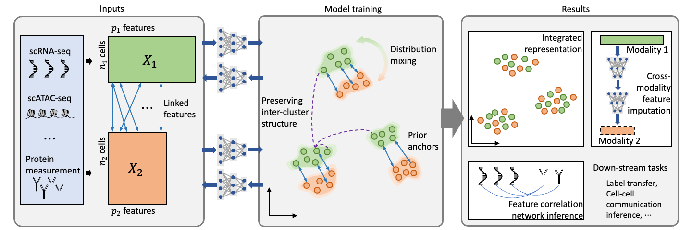

scMODAL
===================================

scMODAL is a deep learning framework tailored for single-cell multi-omics data alignment using feature links.

scMODAL integrates datasets with limited known positively correlated features, leveraging neural networks and generative adversarial networks to align cell embeddings and preserve feature topology.

It not only advances integration tasks but also supports downstream analyses such as feature imputation and inference of feature relationships, offering a robust solution for advancing single-cell multi-omics research.

scMODAL Tutorials
--------

.. toctree::
   :maxdepth: 3
   
   tutorials/index.rst

scMODAL Installation
--------
.. toctree::

   installation
